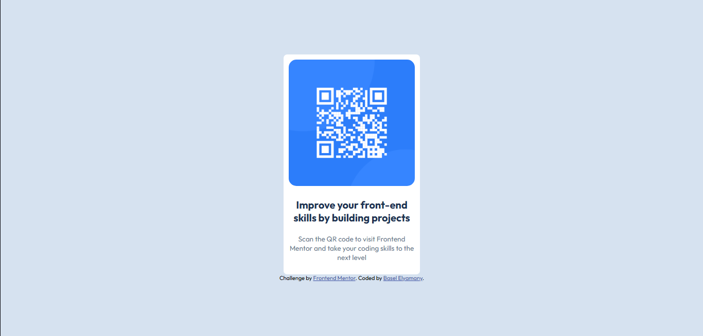

# Frontend Mentor - QR code component solution

This is a solution to the [QR code component challenge on Frontend Mentor](https://www.frontendmentor.io/challenges/qr-code-component-iux_sIO_H). Frontend Mentor challenges help you improve your coding skills by building realistic projects. 

## Table of contents

- [Overview](#overview)
  - [Screenshot](#screenshot)
  - [Links](#links)
- [My process](#my-process)
  - [Built with](#built-with)
  - [What I learned](#what-i-learned)


## Overview
- This is my first project with Frontend Mentor. I had a few problems with it, but in the end, I'm kinda satisfied with the result. I hope you like it too. I used flexbox to align the component and media query for the responsiveness, and did learn a few tricks in the process.

### Screenshot




### Links

- Solution URL: [https://github.com/Basel-Elyamany/qr-code-component-main](https://github.com/Basel-Elyamany/qr-code-component-main)
- Live Site URL: [https://basel-elyamany.github.io/qr-code-component-main/](https://basel-elyamany.github.io/qr-code-component-main/)

## My process

### Built with

- Semantic HTML5 markup
- CSS custom properties
- Flexbox

### What I learned

I learned to use 2 new tricks, and they are clamp and media query, shown below

```css
.proud-of-this-css {
font-size: clamp(13px,1.5vw,20px)
@media (max-width: 375px){}
}
```
Thank you for the challenge, and I hope you can give me feedback about the code and how I could write it in a better way.